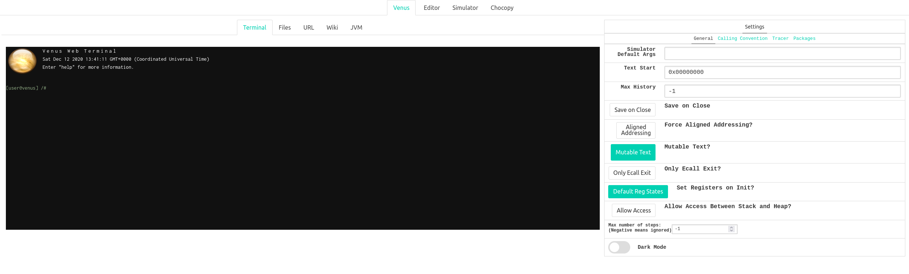
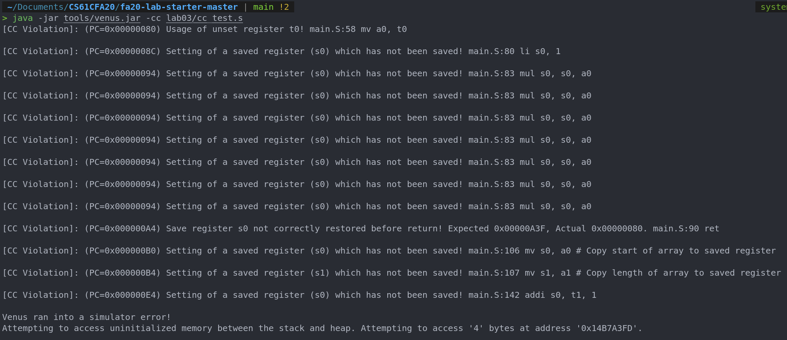

# Lab 03
## Venus
[venus 手册](https://web.archive.org/web/20201205153938/http://cs61c.org/resources/venus-reference#traces)
### The Editor Tab
- 程序从第一行组件代码开始，无论标签如何，除非 `main` 功能用 `.globl` 标记（见下文）。这意味着如果未声明为 `.globl` ，则必须将 `main` 函数放在首位。
  - 注意：有时候，我们希望在程序开始执行之前将某些项目预先分配到内存中。由于此分配不是实际的代码，因此我们可以将其放在 `main` 函数之前。
- 程序以带有参数值10的`ecall`结尾。该计划退出的信号。 `ecall`说明类似于“系统呼叫”，并允许我们做诸如print之类的事情来从主机或从堆中处理或请求大量内存。
- 标签以 `:` 结尾
- 注释以 `#` 开头
- 每行不能有多个指令
- 您可以使用保存键盘快捷键（CMD-S或CTRL-S，具体取决于平台，它将保存文件）。您可以在编辑器底部查看活动文件的名称：如果未命名，它将提示您下载文件，如果您迅速命中保存，也会收到此提示。
- 完成编辑后，单击“模拟器”选项卡以准备执行。
### The SImulator Tab
- 当您第一次从“编辑器”选项卡中到达“模拟器”选项卡时，您会看到一个 “Assemble and Simulate from Editor” 按钮，该按钮将在您的代码中报告错误或重新组装。
- 可以通过单击所需的代码线来设置断点，然后再按“运行”。 您也可以在代码中插入`ebreak`指令以自动强制venus停下来。
  - You can simulate conditional breakpoints by placing an ebreak within a branch, like so: ```
    > #Stops execution if a0 == 3 li t0, 3 bne a0, t0, after_breakpoint ebreak after_breakpoint: ```
- 点击 “Run” 按钮运行您的程序，直到达到断点。
- 点击 “Step” 按钮将转到下一个 assembly instruction。
- 点击 “Prev” 按钮将退回一个 assembly instruction。
- 点击 “Reset” 按钮结束当前运行，清除所有断点，然后返回执行开始。
- “Dump” 按钮为您提供了程序中每个 instruction 的十六进制表示。
- 可以通过右侧的侧边栏看到寄存器，内存和缓存的内容。
  - 可以手动在寄存器中 poke values 以影响程序的执行。
  - 在 “Memory” 选项卡中，使用 “Jump to” 或 “Address” boxes 快速导航到程序中的某个地址。
- 对于所有菜单，请使用窗格底部的 “Display Settings” 在16进制、ASCII、two’s complement decimal和unsigned decimal interpretations之间切换。
-  “Trace” 按钮将基于指定格式的寄存器和内存中转储值.

  

## Exercise 01

1) What do the .data, .word, .text directives mean (i.e. what do you use them for)? Hint: think about the 4 sections of memory.
   > .data定义数据段；.word定义常量，被储存到数据vduan中，.text定义代码段
2) Run the program to completion. What number did the program output? What does this number represent?
   > 34，费波那契数列第九项
3) At what address is n stored in memory? Hint: Look at the contents of the registers.
   > 0x10000008
4) Without actually editing the code (i.e. without going into the “Editor” tab), have the program calculate the 13th fib number (0-indexed) by manually modifying the value of a register. You may find it helpful to first step through the code. If you prefer to look at decimal values, change the “Display Settings” option at the bottom.
   > 233，修改9为13

## Exercise 02
Find/explain the following components of this assembly file.

   - The register representing the variable k.
      > t0
   - The register representing the variable sum.
      >  s0
   - The registers acting as pointers to the source and dest arrays.
      > sp 
   - The assembly code for the loop found in the C code.
       ```rsicv
          loop:
            slli s3, t0, 2
            add t1, s1, s3
            lw t2, 0(t1)
            beq t2, x0, exit
            add a0, x0, t2
            addi sp, sp, -8
            sw t0, 0(sp)
            sw t2, 4(sp)
            jal fun
            lw t0, 0(sp)
            lw t2, 4(sp)
            addi sp, sp, 8
            add t2, x0, a0
            add t3, s2, s3
            sw t2, 0(t3)
            add s0, s0, t2
            addi t0, t0, 1
            jal x0, loop
        ``` 
   - How the pointers are manipulated in the assembly code.
      ```riscv
      addi sp, sp, -size*4
      sw re, num*4(sp)
      ```
## Exercise 04

- What caused the errors in simple_fn, naive_pow, and inc_arr that were reported by the Venus CC checker?
   > 1. t0 没有初始化  
   > 2. 不能使用saved register （s0），会破坏调用者的寄存器内容
   > 3. helper_fn修改了s0
- In RISC-V, we call functions by jumping to them and storing the return address in the ra register. Does calling convention apply to the jumps to the naive_pow_loop or naive_pow_end labels?
- Why do we need to store ra in the prologue for inc_arr, but not in any other function?
- Why wasn’t the calling convention error in helper_fn reported by the CC checker? (Hint: it’s mentioned above in the exercise instructions.)
